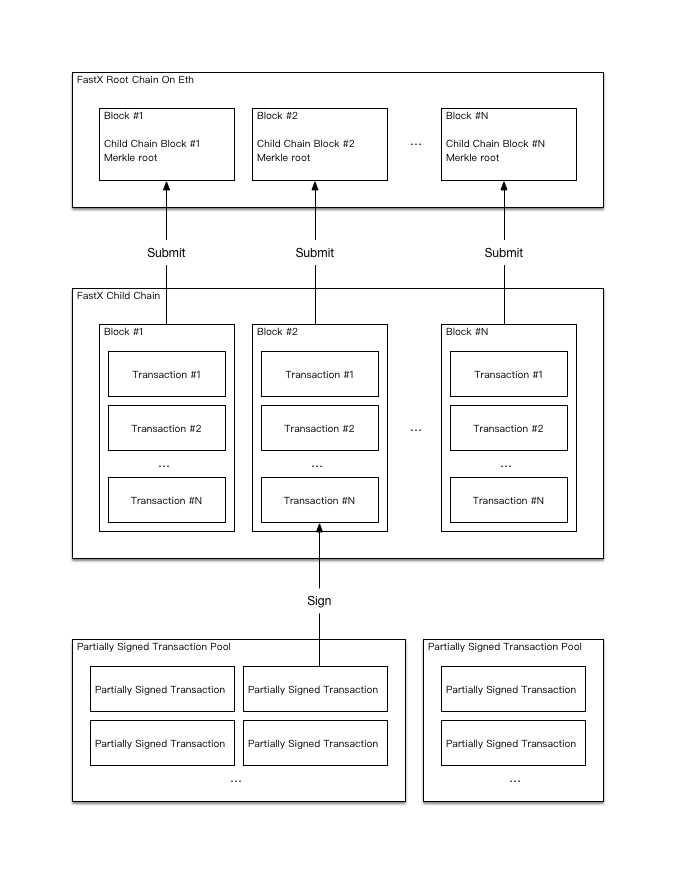
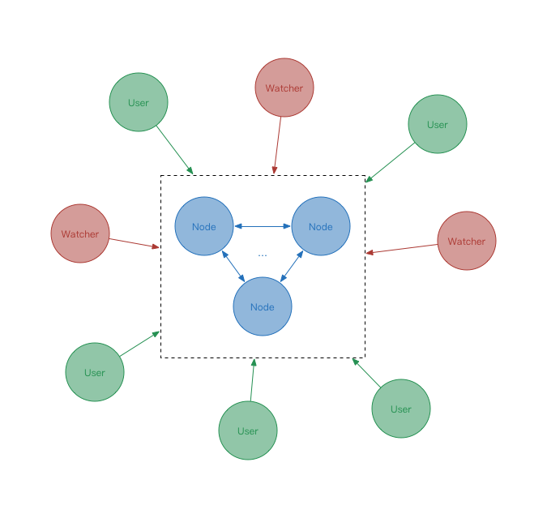
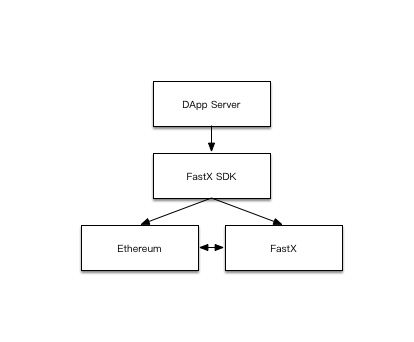

## FastX 架构介绍

​	FastX 是一个基于 Plasma 技术的去中心化交易协议，是一种对 Eth 的二层扩展。FastX 将交易过程中尽可能多的环节移至线下，仅在发生争议的时候将证据提交到 Eth 主链做最终裁定，从而能在保证安全性的前提下显著提高交易量及交易速度，缓解 Eth 的拥堵，降低 gas 费用。

### 1、系统架构

​	FastX 系统主要分成三个部分：主链合约、子链、半签池。它们的相互关系如下图：

#### 1.1、主链合约

​	FastX 主链合约是整个系统的基石，也是 FastX 与 Eth 主网进行交互及最终仲裁的地方。

​	用户可以通过主链合约将自己的 Eth、ERC20 或 ERC721 资产存入 FastX，同样也可以申请提现，经过一段时间的挑战期，就可以将自己的资产从 FastX 系统中重新提回 Eth 主网。如果用户发现 FastX 系统有任何人、节点做恶，那么他就可以在主网合约中提出挑战，挑战成功后将会得到额外奖励。

#### 1.2、子链

​	如果说主链合约是系统的基石，那么子链就是整个系统的核心。当资产进入 FastX 系统之后，用户就可以在子链中享受高速、便捷的交易体验。

​	FastX 节点会收集在子链中进行的交易，达到一定数量或一段时间之后将这些交易打包到一个区块中，整个区块将以一个 Merkle Tree 的形式进行存储，并将 Merkle Tree 根节点的哈希值提交到主链合约中。因此大量的交易被压缩成了 Eth 主网上的一次提交，从而可以大大降低 Eth 主网的压力以及耗费的 gas 费用。

#### 1.3、半签池

​	半签池是对整个系统的一个扩充，半签池中存放了大量报价单。在某种程度上也可以理解为订单薄。用户设置好他需求的买卖价格、买卖种类、以及该需求的过期时间后就可以将它进行签名并存放至半签池中，如果其他用户能满足他的需求那么该用户只需要读取他所需的报价单，签上自己的名字后发布至子链即可。整个系统中可以有任意数量的半签池，半签池为整个系统提供了交易深度。

### 2、网络架构

​	FastX 的网络主要由三个角色组成：节点、观察者、用户。他们的关系如下图：

#### 2.1、节点

​	节点是 FastX 网络的核心，所有交易都将由节点进行打包并将 Merkle Tree 根节点哈希值提交到 Eth 主网。节点之间的共识可以是任意形式的，这只会影响到子链的运行效率而并不会影响到它的安全性，因为如果发生争议，这些争议都会被提交到主链合约，并在那里进行最终仲裁。因此，在追求效率的情况下甚至可以只使用一个节点从而直接避免共识机制所需要的额外消耗。

​	节点从用户提交的交易中收取手续费以抵消节点向主网提交 Merkle Tree 根节点哈希值所需要的 gas 费用并且也可以从中获取收益。同时，节点需要在主链合约中抵押一部分资产作为保证金以提高自己的可信度，当用户证明节点做恶他就可以获取一部分保证金作为对他的奖励以及对节点的惩罚。

​	节点可以选择性的维护一个半签池，半签池可以增加交易深度，让用户的交易更容易达成，因此维护一个半签池对于节点来说也是有利的。

#### 2.2、观察者

​	观察者并不是一个必须的角色，观察者的主要工作是对整个网络（主要是节点）进行观察，从而防止有人做恶，并从中获取回报。我们注意到在一个健康的网络中做恶的人是很少的，在这种情况下，观察者依然可以通过帮助用户完成退出流程，从中获取用户提交的一部分退出手续费。用户在发出将他的资产提回 Eth 主网的请求之后需要等待一段时间来允许其他人进行挑战，在挑战期结束之后再次请求才能完成整个流程，这时观察者就能帮助用户完成流程而不需要再发起额外的请求。

#### 2.3、用户

​	作为整个系统的使用者，用户同时也可以作为一个观察者对整个网络进行观察。不需要信任任何其他角色，就能保证自己的资产是安全的。

### 3、SDK

​	FastX 为开发者提供了一个全功能的 sdk，传统开发者即使不了解区块链底层架构，也能方便的进行 DApp 开发。

​	FastX SDK 提供了基于 FastX 网络接口的高级封装，开发者可以使用 FastX SDK 操作他们在 Eth 主网和 FastX 网络中的资产完全不需要更改原有的 App 架构。

### 4、总结

​	FastX 致力于提供一个安全、高效、便捷的区块链资产解决方案。无论是对于用户还是对于开发者，我们都希望能做的更好，让区块链的世界越来越大。