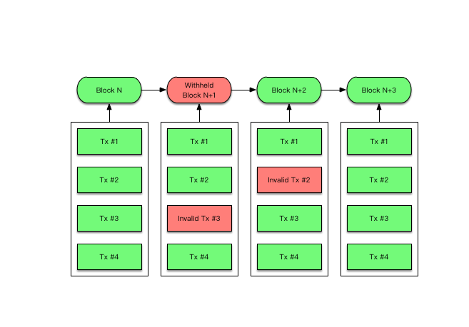

## Plasma事务无确认及快速打包区块方案

在 Plasma 子链中达成事务需要确认过程。这个过程对于用户来说非常不友好，因为这使得用户必须在先签一个事务，提交并等待它被打包进区块后再签另一个确认事务。目前的事务无确认解决方案都要求事务的输入所在的区块在该事务所在区块之前，即事务不能包含事务所在区块的输入，而区块需要在以太坊主网进行确认，这意味着用户必须等待事务被提交至以太坊主网后才能再次将该事务作为输入产生新事务，以太坊主网平均16秒产生一个区块，这也意味着在 Plasma 子链中单个资产的流转速度也无法超过每次16秒。本文将基于 David Knott, Kelvin Fichter 的 [“Plasma w/o Confirmations”](https://github.com/omisego/research/blob/master/plasma/plasma-mvp/specifications/no-confirmations.md) 方案以及 Ben Jones, Kelvin Fichter 的 [“More Viable Plasma”](https://ethresear.ch/t/more-viable-plasma/2160) 方案，提出一个新的解决方案，以使 Plasma 可以在事务无需确认的同时可以快速打包区块，从而大大增加资产流转速度。

### 检查点

首先我们引入检查点的概念。简单的来说检查点是若干连续区块所形成的二叉哈希树的根哈希。下面我们来演示一下检查点的构建，我们假定有一段连续的区块 Block1，Block2，Block3，Block4。

1. 计算区块的根哈希。 `blockMerkelRoot = Merkle(hashedTransactions).root`
2. 将区块号和区块用 RLP 编码，并进行哈希。`hashedBlock = sha3(rlp(blockNumber, blockMerkleRoot))`
3. 计算检查点的根哈希。`checkpointMerkelRoot = Merkle([hashedBlock1, hashedBlock2, hashedBlock3, hashedBlock4]).root`

有了检查点后，接下来我们使用检查点的根哈希来代替区块根哈希提交至以太坊主网合约。

如图所示，用这种方法可以压缩信息密度，并可以使区块的产生速度大于以太网主网确认速度。

### 区块发布

由于引进检查点，区块不再发布至以太坊主网合约，而是直接向用户公布，公布时需要带上节点签名，即需发布区块号、区块信息以及`sign(rlp(blockNumber, blockMerkleRoot))`。当累积到一定区块量后再生成检查点并将检查点发布至以太网主网。

### 挑战检查点

当用户收到节点广播的区块信息，他可以在某种程度上信任该区块并基于该区块产生新的事务。如果节点没有将该区块正确的打包到检查点并发布至主网合约时，用户可以通过以下步骤挑战检查点。

1. 用户提交 `rlp(blockNumber, blockMerkleRoot)` 以及 `sign` 并附上一定数量 Eth 作为抵押，挑战 blockNumber 所在检查点
2. 在一定期限内，节点做出回应，回应需要提交  `rlp(blockNumber, blockMerkleRoot)`  存在于该检查点的证明，如果没有回应，则该检查点视为无效。

由于检查点具有被无效化的风险，因此请将本方案使用在能够承担此风险的场景中。

### 无效化检查点攻击

由于可以通过提交区块签名的方式使检查点无效化，节点可能自行提交区块签名以使某个检查点无效。为了减少这种攻击的可能性，我们需要增加以下规则：

1. 两个检查点之间需要间隔 `N` 个 ETH 区块
2. 只能挑战在最近的 `M` 个 ETH 区块中的区块
3. 挑战成功后除了挑战者获得节点抵押的一定数量的代币以外，节点还必须销毁一部分代币

规则1、规则2 保证了用户拥有足够的时间对检查点进行挑战，同时也保证了较早的检查点不会被无效化。

规则3 保证了即使发生节点通过自己挑战检查点使检查点无效化，它依旧要损失一部分代币。从而防止节点自行无效化检查点。

### 证明事务存在性

由于以太坊主网合约不再存储区块信息而是改为存储检查点信息，事务的存在性证明也需要做相应改变。如果要证明一个事务存在于某个区块中，现在需要以下信息。

1. 事务信息 `rpl(transaction)`
2. 事务存在于区块的证明 `block.merkle.create_membership_proof(transaction.merkle_hash)`
3. 区块存在于检查点的证明 `checkpoint.merkle.create_membership_proof([blockNumber, blockMerkleRoot].merkle_hash)`

### 退出

退出方案基于 David Knott, Kelvin Fichter 的 [“Plasma w/o Confirmations”](https://github.com/omisego/research/blob/master/plasma/plasma-mvp/specifications/no-confirmations.md) 方案以及 Ben Jones, Kelvin Fichter 的 [“More Viable Plasma”](https://ethresear.ch/t/more-viable-plasma/2160) 方案。需要满足以下几点规则。

1. 事务必须在 `1` 天内被发布至太坊主网合约
2. 事务的输入所在区块不能等于事物所在区块
3. 退出以事务最大输入区块号顺序作为第一序，事务所在区块号逆序作为第二序进行排队，退出需要等待 `7` 天
4. 退出事务时需要同时验证它所有输入
5. 事务挑战期为 `3` 天

以上各规则中的时间可以做相应调整。

规则1 保证了节点不能将事务包含在过晚的区块中。

规则2、规则3、规则4 保证了合法事务比非法事务有更高的退出优先权。

规则5 保证了延后退出的事务依然比非法事务有更高的退出优先权。

### 区块拒绝服务攻击

对于 Plasma 系统，节点不公开区块信息所发起的区块拒绝服务攻击是一个很大的问题。规则的制定很大程度上也围绕着防御区块拒绝服务攻击进行的。

如上图所示，假设节点在 BlockN+1 发起了区块拒绝服务攻击，不公开 BlockN+1 的信息。那么节点可以在 BlockN+1 创建非法事务 Tx3，在 BlockN+2 创建非法事务 Tx2，并试图退出。

对于在 BlockN+1 中的 Tx3。由于规则2，BlockN+1 中的 Tx3 的输入必须小于 N+1，由于 BlockN+1 之前并没有非法输入，根据规则4，Tx3 的非法输入无法通过验证。

对于在 BlockN+2 中的 Tx2。由于节点发起攻击后不会有新的事务进行提交，所以在 BlockN+1 及其以后区块中的合法事务的输入所在区块号均小于N+1。而 BlockN+2 中的 Tx2 是用的非法输入创建于 BlockN+1，由于规则3，该非法交易的退出优先权低于所有其他合法交易，此时若所有用户都按规则退出，该非法事务退出时合约已被清空，节点将无法获得它的非法所得。

### 场景

我们来考虑以下场景。

#### A 和 B 都是诚实且合作的

1. **A** 使用 `UTXO1` 通过 `TX1` 发送给 **B**，**B** 得到 `UTXO2` 
2. **节点** 发起攻击，不公开区块信息，因此 **A** 和 **B** 都不知道 `TX1` 是否被包含在区块中
3. **A** 发起退出 `UTXO1`
4. `4` 天内 **节点** 通过 `TX1` 发起挑战，从而公开了 `TX1` 信息
5. **B** 通过 `UTXO2` 退出，由于 `UTXO2` 所在事务 `TX1` 的输入 `UTXO1` 比 **节点** 伪造的非法事务的输入区块号更早，因此有更高的退出优先权，由于此时仍在 `7` 天内，**节点** 尚未成功退出非法事务
6. **B** 成功退出，此时若所有用户都按规则退出，**节点** 提交的非法事务退出时合约已被清空，它将无法获得它的非法所得

#### B 退出一个已被花费的输出

1. **A** 使用 `UTXO1` 通过 `TX1` 发送给 **B**，**B** 得到 `UTXO2` 
2. `TX1` 被打包到区块 `N`
3. **B** 在 `TX2` 中花费了 `UTXO2` 
4. **B** 发起退出 `UTXO2` 
5. 任何人都可以通过 `TX2` 挑战 **B** 的退出，并获得 **B** 的退出抵押，**B** 退出失败

#### A 双花他的输入

1. **A** 使用 `UTXO1` 通过 `TX1` 发送给 **B**，**B** 得到 `UTXO2` 
2. `TX1` 被发布在区块 `N` 中
3. **A** 在 `TX2` 中再次使用 `UTXO1`，得到 `UTXO3` 
4. `TX2` 被发布在区块 `N+M` 中
5. **A** 发起退出 `UTXO3` 
6. **B** 发起退出 `UTXO2` ，由于 `UTXO2` 所在区块 `N`  比 `UTXO3` 所在区块 `N+M` 更早，因此有更高的退出优先权，**B** 成功退出

#### 节点从包含的事务中窃取资金

1. **A** 使用 `UTXO1` 通过 `TX1` 发送给 **B**，**B** 得到 `UTXO2` 
2. `TX1` 被发布在区块 `N` 中
3. **节点** 创建非法存入，创造 `UTXO3` 
4. **节点** 在 `TX3` 中使用 `UTXO3`，得到 `UTXO4` 
5. **节点** 发起退出 `UTXO4` 
6. **B** 发起退出 `UTXO2` ，由于 `UTXO2` 的输入所在区块比 `UTXO4` 的输入所在区块更早，因此有更高的退出优先权，**B** 成功退出

#### 节点从未确认事务中窃取资金

1. **A** 使用 `UTXO1` 通过 `TX1` 发送给 **B**，**B** 得到 `UTXO2` 
2. `TX1` 尚未被包含在区块中
3. **节点** 创建非法存入，创造 `UTXO3` 
4. **节点** 在 `TX3` 中使用 `UTXO3`，得到 `UTXO4` 
5. **节点** 发起退出 `UTXO4` 
6. **A** 发起退出 `UTXO1`，由于 `UTXO1` 的输入所在区块比 `UTXO4` 的输入所在区块更早，因此有更高的退出优先权，**A** 成功退出