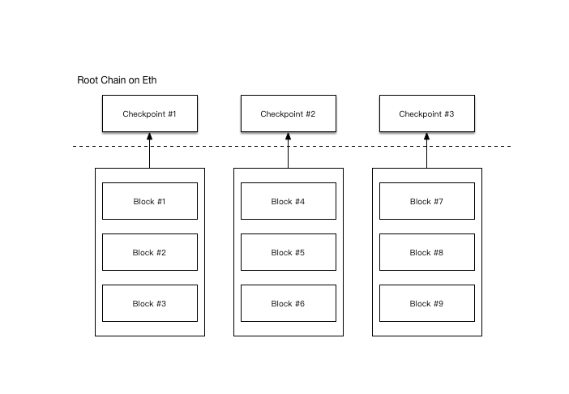

## Plasma 快速打包区块方案

目前在 Plasma 子链中达成事务要求事务的输入所在的区块在该事务所在区块之前，即事务不能包含事务所在区块的输入，而区块需要在以太坊主网进行确认，这意味着用户必须等待事务被提交至以太坊主网后才能再次将该事务作为输入产生新事务，以太坊主网平均16秒产生一个区块，这也意味着在 Plasma 子链中单个资产的流转速度也无法超过每次16秒。本文提出一种解决方案，以使 Plasma 可以快速打包区块，从而大大增加资产流转速度。

### 检查点

首先我们引入检查点的概念。简单的来说检查点是若干连续区块所形成的二叉哈希树的根哈希。下面我们来演示一下检查点的构建，我们假定有一段连续的区块 Block1，Block2，Block3，Block4。

1. 计算区块的根哈希。 `blockMerkelRoot = Merkle(hashedTransactions).root`
2. 将区块号和区块用 RLP 编码，并进行哈希。`hashedBlock = sha3(rlp(blockNumber, blockMerkleRoot))`
3. 计算检查点的根哈希。`checkpointMerkelRoot = Merkle([hashedBlock1, hashedBlock2, hashedBlock3, hashedBlock4]).root`

有了检查点后，接下来我们使用检查点的根哈希来代替区块根哈希提交至以太坊主网合约。

如图所示，用这种方法可以压缩信息密度，并可以使区块的产生速度大于以太网主网确认速度。

### 区块发布

由于引进检查点，区块不再发布至以太坊主网合约，而是直接向用户公布，公布时需要带上节点签名，即需发布区块号、区块信息以及`sign(rlp(blockNumber, blockMerkleRoot))`。当累积到一定区块量后再生成检查点并将检查点发布至以太网主网。

### 挑战检查点

当用户收到节点广播的区块信息，他可以在某种程度上信任该区块并基于该区块产生新的事务。如果节点没有将该区块正确的打包到检查点并发布至主网合约时，用户在时限内，可以通过以下步骤挑战检查点。

1. 用户提交 `rlp(blockNumber, blockMerkleRoot)` 以及 `sign` 并附上一定数量 Eth 作为抵押，挑战 blockNumber 所在检查点
2. 在一定期限内，节点做出回应，回应需要提交  `rlp(blockNumber, blockMerkleRoot)`  存在于该检查点的证明，如果没有回应，则该检查点视为无效。

由于检查点具有被无效化的风险，因此请将本方案使用在能够承担此风险的场景中。

### 证明事务存在性

由于以太坊主网合约不再存储区块信息而是改为存储检查点信息，事务的存在性证明也需要做相应改变。如果要证明一个事务存在于某个区块中，现在需要以下信息。

1. 事务信息 `rpl(transaction)`
2. 事务存在于区块的证明 `block.merkle.create_membership_proof(transaction.merkle_hash)`
3. 区块存在于检查点的证明 `checkpoint.merkle.create_membership_proof([blockNumber, blockMerkleRoot].merkle_hash)`

### 总结

通过增加检查点机制，以一定时间内检查点可能被无效化作为代价，可以使区块的产生速度大于以太网主网确认速度，从而大大增加资产流转速度。