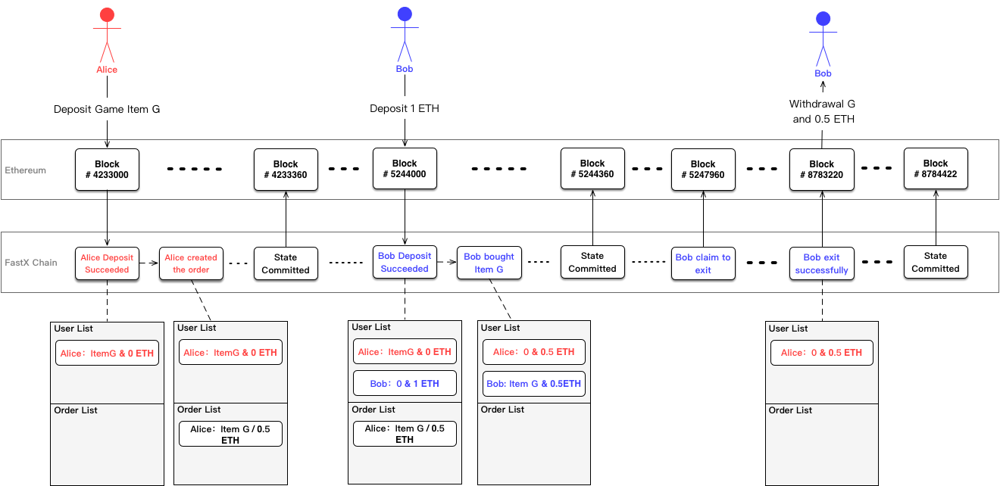

# FastX - An Open Protocol for Secure and Fast Crypto-goods Exchange


> This is still an early draft, any comments and feedbacks are welcome! Email: max@fastx.pro 


## Abstract

This protocol aims to bring fast and low fee token exchanges to any dApps running on Ethereum. It helps those applications to make full use of their existing technology frameworks, and to conveniently integrate the blockchain technology. FastX eliminates the need for each application to independently develop, operate, and maintain its own exchange system. Through direct wallet-to-wallet transactions, it aso increases the liquidity sharing between dApps. By extending Plasma, FastX brings both on-chain security and off-chain high speed and low fee features to various token assets trading. 


## 1. Introduction


There have been all kinds of crypto exchanges got hacked and even went bankruptcy, from Mt. Gox, to Bitfinex, to the latest Bancor network hacks. In the first half of 2018 alone, the exchanges has been stolen over 730 million US dollars, which is over 3 times more that that of 2017. Everyone is actally got affected by the market crashes caused by those big hacks. It is because crypto exchanges, just like crypto mining, are at the core of the crypto world.

Then a new type of exchanges called decentralized exchanges, or DEX, are trying to solve the security issues of centralized exchanges. Instead of pooling all users' assets together in the exchange's wallets, DEX allows users to exchange tokens directly on the blockchain. 

But one problem with DEX is that its trading speed is limited by the transaction confirmation time of the underlying blockchain, which is way much slower than centralized exchanges. For example, a single block confirmation takes about 14 seconds on Ethereum, comparing to transactions are finished in milli-seconds in the centralized exchange. 

Another issue with DEX is that each trade needs to pay not only fees to the exchange, but also transaction fees to the underlying blockchain. And what makes it even worse is that the more trades on DEX, the higher transaction fees users have to pay because users have to compete with each other, by paying higher fees to incentivize miners to process their transactions first.

To solve all the above issues, we are proposing a new decentralized token exchange protocol on Ethereum, called FastX.


## 2. FastX Protocol


### Overview

Here, we propose an open token exchange protocol on Ethereum, FastX. It is built with Plasma[^plasma] framework, and consists mainly of 3 components, which are Root-chain Smart Contract(RSC), the child-chain operators, and the clients. Each component can be run by different teams or entities, and together they collaborate to facilitate token tradings under the specifications of FastX protocol. Instead of building everything from scratch, FastX is designed to be easily integrated with existing web and mobile apps, so they can take advantage of blockchain technologies with existing techology stacks and infrastructures. 

While current decentralized exchanges managed to move order matching off-chain (like 0x[^zero_x]), FastX is able to offload both order matching and transacton settlement away from the blockchain. By extending Plasam, FastX added new types of transactions which allow users to create maker orders directly from their clients, sign the orders and broadcast them to FastX network. Once other clients receive the maker orders from the network, they validate the orders, and filter them with users' criterias. Once there are matches, takers can sign the orders directly from the clients and broadcast to the network. Child chain operators include validate transactions to the block, calculate the Merkle root of the transaction tree, and periodically commit the root hash to RSC on Ethereum. Once confirmed on Ethereum, the committed hash can be verified by any user. If someone tries to steal money from FastX, anyone can challenge the attacker by sending a transaction to RSC with the proof attached, and RSC makes the verification and final decisions to block the money stealing and to reward the challenger with the deposits from the attacker.


### Features

Besides features like safe and secure of users' assets in DEX, high transaction throughput, and low transaction fees which are provided by Plasma, FastX also provides the following extra benefits.


- #### ERC20 and ERC721 Supports


ERC20 and ERC721 are the most widely used tokens on Ethereum. We added new attributes `contractAddress`, `amount`, `tokenId` to the Transaction data structure, and extended `deposit` and `exit` in Plasma to support them.


- #### Built-in Order TX


To improve the user experience of order matching, we added new types of _Order_ transactions. So, a user can create a maker order by specifying the token and amount he wants to sell in his client, signs the order and broadcasts to the network. Other clients pick up the order from the network, and allows a taker to then sign the whole order tx in her client and send back to the network for settlement. This way no third-party relays are needed any more.


- #### Transaction Timeout


To facilitate the liquidity of the network, and prevent someone to sign the order and wait long enough until making profts, We added `expireTime` to the _Order_ transaction. Once the transaction expires, it cannot be included into the block even it is signed both by the maker and the taker.


- #### Instant Tx Finality


It is crucial for a better UX to have a very responsive UI, and that asks for transaction confirmations to have very low latencies. We are working on a solution where child chain operators sign all pending transactions, which promise to include those transactions in the next few blocks. This way, the child chain can provide almost instant transaction finalities.


- #### In-app Exchange SDK


To allow users to easily use a dApp, even without its own token, FastX provides SDKs, both for the client and the server, for developers to easily integrate with. So a user is able to buy dApp's token right in the app with various kinds of tokens he owns, or to exchange tokens with other users inside of the app without having to log on to an exchange website.


### Sample Walk-through

The following is a simple walk-through of how FastX works.





Let’s say, CryptoFu is a blockchain game, and runs on FastX protocol;

- Alice joins the game by making a deposit of her game prop Item G from Ethereum;
- Once succeeded, she can see her Item G is showing up in CryptoFu. She can play with it, or she can sell it by creating a sell order; signs it with her wallet and has it broadcasted;
- Sometime later, Bob joins the game and deposits 1 ETH;
- Bob stumbles upon Item G and is willing to take Alice’s offer. He then signs his take order and sends it to FastX nodes;
- Once processed, Bob owns Item G and spends his 0.5 ETH to Alice, with 0.5 ETH as change returns to his own wallet. 
- Later, Bob decides to withdrawal all his assets back to Ethereum. He has to send the exit request first, and wait for a certain period;
- During that period, if anyone finds Bob’s not honest, she can send a transaction with the proof to RSC. Once verified, the challenger is rewarded, and Bob’s exit request is cancelled;
- If everything is fine, Bob’s withdrawal finishes after the waiting period.


## 3. Ecosystem Participants

FastX consists of a number of components, and each component can be developed  and operated by independent teams. Each participant collaborates through the protocol interface to ensure the security and efficiency of the trading process. The main participants include wallet providers, liquidity providers, child chain operators, watchers, and root-chain smart contracts.


### Wallet Providers

Wallet providers can be wallet apps, client SDKs, or professional assets custody services. They provide 5 functions for the users: 

- Give users access to their tokens in FastX;

- Broadcast transactions to the FastX network;

- Match orders in FastX;

- Validate token transactions;

- Challenge invalid asset withdrawals;

Wallet providers can share tx fee revenue with child chain operators. We are working on an easy-to-integrate SDK as a reference implementation for the wallet providers.


### Liquidity Providers

Any apps or games that integrate FastX are considered as liquidity providers. They are able to join an existing network and share liquidity with others over a network. The network we are building as a first implementation of FastX protocol has a near real time order sharing and transaction settlement. Liquidity providers are incentivized to join the network to mine FastX tokens, FEX. Notably, apps or games don't need to join this network; they can act alone and decide not to share liquidity with others, or they can simply start and manage their own liquidity sharing network.


### Root-chain Smart Contracts (RSC)

RSC works like a bridge between Ethereum and child chains, and it makes sure users' assets in FastX are safe and secure. There are mostly 3 things RSC is doing.

- It allows users to move their assets back and forth between Ethereum and child chains. But unlike traditional exchanges that require users to totally give up their controls of the assets, RSC locks users' assets on Ethereum, and just creates mirrored copies in the child chain for trading.

- RSC stores all the Merkle root hashes of child chain blocks submitted by the child chain operators. 

- RSC makes final decisions for any withdraw requests when users are done and need to withdraw their assets back to Ethereum.


### Child-chain Operators

The operators run FastX child chain nodes. There can be any number of child chains running on FastX. Each child chain has its corresponding RSC, and can have one or more nodes, which depends on the consensus mechanism of that chain. There can be a few dApps running on a single child chain, or just one single dApp running on the child chain, which is tailered to a the specific dApp, probably for its transcation volume or some specific requirements.

The operators validate all pending transactions on the child chain, and include the valid ones into a block, calculate the merkle root hash of the block, and then submit the hash to Ethereum periodically. Anyone can run the operator node, but to be accepted by the RSC, an operator needs to stake a certain amount of FEX tokens. RSC only accepts top N highest staked nodes to be valid operators. If the operators fail to run the nodes properly, all the users have to exit from the child chain. The operator charges FEX for the transaction fees. And operators are free to choose to run any consensus algorithm they see fit for their specific needs, including Proof-of-Authority (PoA), Proof-of-Stake (PoS), delegated-Proof-of-Stake (dPos) etc. 


### Watchers

It is crucial for FastX users to get online and connect to the child chain at least once in the challenge period to validate all new transactions of their tokens and to challenge invalid withdraw requests. In order to relief the burdens from the users, watcher nodes can do all those heavy-liftings for the users. When a user sends a withdraw request, he also needs to stake a fee with the request. Watchers validate all the withdraw requests. If a withdrawal is found to be malicious, like trying to double spend, the watcher can send a `challengeExit` request to the RSC with a proof. Once confirmed on Ethereum, the malicious exit will be cancelled, and the bonded fee will be rewarded to the watcher. 

Watcher nodes can also advertise their services to the users to alert the registered ones when there are invalid exits or even the entire child chain goes south, like the operator is withholding a block. Once users are notified, they can exit the child chain accordingly.


## 4. Trading Process

### Deposits

To trade tokens, a user needs to deposit his assets into the child chain by calling the deposit function of RSC. That essentailly tranfers user's tokens to the FastX smart contract and locked on Ethereum. Once confirmed, FastX creates mirrored assets in the child chain for trading later.


### Order Creation

A user creates orders by creating a specific transaction called partially-signed transaction. Besides specifying the regular information of an order, like The user the token name and amount to sell, the name and amount buy, and other parameters, like the order expiration date etc, the user needs to signed the order transaction with his private key. An amount of FEX token can be added to the order as a fee. A higher fee means a better chance to be processed earlier by the operators.


### Order Broadcasting

The wallet sends the signed order to one or more child chain operators. They update their public order book. FastX doesn't require order books to be built in a certain way. But we've built a partially-signed order transaction pool for a reference implementation. But, operators have the power to make their own design decisions in building their order books.


### Liquidity Sharing

Operators broadcast orders to other nodes through any arbitrary communication medium. They themselves decide how to interact with each other. To facilitate the liquidity sharing, we are building a dPoS blockchain that is optimized for speed and inclusivity.


### Order Matching

Instead of relying on a third-party relay to match orders, Users search orders directly in the FastX clients. The orders are partially-signed transactions synced from nodes and other clients. For example, Alice wants to buy a 1-Gen CryptoKitties with fast cooldown time and is within 1ETH price range. She then can set those requirements in the client and search the orders synced from the nodes and other clients. Once there are orders meet her requirements, Alice sees the results. She can then pick up the one she likes and signed the transaction. Because the order is already signed by that CryptoKitties' owner Bob, Alice doesn't have to wait for the reply from Bob. Once Alice's transaction is include in the block, her deal is done instantly.


### Validate Transactions

There are 2 kinds of transaction validations. Operators validate all the pending transactions, and user clients need to validate all included transactions since the last confirmed block. The operators make sure that the pending transactions have correct inputs, outputs, amounts and signatures, and then include valid ones into a block and throw away invalid ones. Clients validate transactions in the same way but they need to validate all the transactions of their receiving tokens since the last block the tokens are included in the block and comiitted to the root chain.


### Submit Blocks

Each transaction on the FastX chain has a block number. This block number is the sequence number of the FastX chain state that has been submitted to the root chain. The FastX chain in every few seconds generates a Merkle root hash for the block containing the pending transactions and then submits the hash to the root chain. If users need to  verify for any transaction, they just need to provide the subchain block number, transaction ID, and the Merkle proof of the transaction.


### Withdrawal

User withdraw assets in FastX network by sending withdraw requests to RSC on Ethereum. There are two cases here. Frst, the user trusts the previous Merkle root hash submitted by the FastX chain. The other is that the user does not trust the status of the previous block.

In the first case, the user only has to wait until his final asset balance is submitted to the root chain and confirmed, he only needs to generate a Merkle root hash containing his final balance and send a transaction to RSC and wait until the challenge period ends, then the withdrawal application can be approved.

In the second case, the user needs to skip the untrusted state and recall the trusted FastX chain state, which was previously confirmed by the root chain. Then Merkle root hashs containing all transactions from this state to the current withdrawal state need to be constructed and then included in the withdraw request transaction, and then be sent to RSC altogether. Therefore, we can see that the cost of this kind of withdraw rquest is much higher than the former. 

It should be noted here that since the user's withdrawal is submitted from the root chain, even if all operating nodes of the child chain stop working, it is still possible to ensure that the user controls 100% of their assets. When users apply for asset withdrawal, they must attach a specified deposit. If there is no problem with the withdraw request, the deposit will be returned to the user together with his assets from FastX network.


## 5. Operational Flexibility

This protocol does not bias any participating party, nor does it restrict any party to charge money or to be free. Wallet providers, liquidity providers, chain operators, and watcher nodes can set their flexibilities according to their own preferences, and even establish brand new business models on top of it. This highly modular protocol provides an open and basic standard for various types of applications.


### Order Book

The liquidity providers are free to design their order book in their own ways. Our current implementation follows an OTC model, where limit orders are positioned based on price alone, and timestamps of orders have no bearing on the order book. But any configuration is possible.


### Liquidity Sharing

Liquidity providers are free to design how they share liquidity (orders) with each other. Our dPoS FastX blockchain is but one solution to accomplish this, and the ecosystem is free to network and communicate as they wish. Besides joining a blockchain, they can build and manage their own, creating rules/incentives as they see fit. Liquidity provider can also work alone, as seen in the time-sensitive wallet implementation. Of course, there are clear advantages in communicating with other nodes in pursuit of network effects, however, different business models could merit peculiar sharing designs and split fees in any number of ways.


### Child-chain Consensus

This protocol does not define the consensus mechanism used by each FastX chain. Any FastX chains can adpot any kind of consensus algorithem they see fit for their use cases, including centralized trading engines, or decentralized consensus mechanisms to satisfy different transaction handling capacity demands. Regardless of which consensus mechanism used by FastX chain, it does not affect the security of user assets in the FastX chain. 


## 6. FastX Protocol Specification

### 1. Data Structure

#### Token Deposit

FastX will create UTXO token in child chain after FastX's root chain smart contract received ETH, ERC20 or Erc721 token.

```javascript
struct UTXO {
    address owner;
    address contractAddress; // The smart contract address for the token. If the token is ETH, it will be 0
    uint256 amount; // If the token is ERC721, it will be 0
    uint256 tokenId; // If the token is ERC20, it will be 0
    uint256 blockNumber;
    uint128 txIndex;
    uint128 oIndex;
}
```

#### Transaction

```javascript
struct Transaction {
    uint256 expireTimestamp;
    uint256 salt;
    
    uint256 blockNumber1;
    uint128 txIndex1;
    uint128 oIndex1;
    byte32 sign1; // Need sign all params except sign1, sign2, blknum2, txindex2, oindex2, newowner2
    
    uint256 blockNumber2; // if no input2, it will be 0
    uint128 txIndex2; // if no input2, it will be 0
    uint128 oIndex2; // if no input2, it will be 0
    byte32 sign2; // Need sign all params except sign1, sign2, blknum1, txindex1, oindex1, newowner1
    
    address newOwner1;
    address contractaddress1; // The smart contract address of the new owner1's token. If the token is ETH, it will be zero
    uint256 amount1; // If the token is ERC721, it will be 0
    uint256 tokenid1; // If the token is ERC20, it will be 0
    
    address newOwner2;
    address contractaddress2; // The smart contract address of the new owner2's token. If the token is ETH, it will be zero
    uint256 amount2; // If the token is ERC721, it will be 0
    uint256 tokenid2; // If the token is ERC20, it will be 0
    
	uint256 fee; // transaction fee (FEX)
	
    uint256 blockNumber;
    uint128 txIndex;
    uint128 oIndex;
}
```


### 2. API

FastX provided a JS client for developers.


#### getAllUTXO

##### params

address: `address`, address of the UTXOs

##### return

The Address's all available UTXOs in child chain


#### deposit

##### params

contractAddress: `address`, the smart contract address for the depositing token, 0 if ETH

amount: `uint256`, the depositing amount, 0 if ERC721

tokenid: `uint256`, token id for the asset, 0 if ERC20

##### return

transaction hash


#### sendTransaction

##### params

blknum1: `uint256`, block number of input 1

txindex1: `uint256`, transaction number in that block for input 1

oindex1: `uint256`, output number of that transaction for input 1

blknum2: `uint256`, block number of input 2

txindex2: `uint256`, transaction number in that block for input 2

oindex2: `uint256`, output number of that transaction for input 2

newowner1: `address`, owner of output 1

contractaddress1: `address`, asset address for output 1, 0x0 if ETH

amount1: `uint256`, the amount for the asset, 0 if ERC721

tokenid1: `uint256`, token id for the asset, 0 if ERC20

newowner2: `address`, owner of output 2

contractaddress2: `address`, asset address for output 2, 0x0 if ETH

amount2: `uint256`, the amount for the asset, 0 if ERC721

tokenid2: `uint256`, token id for the asset, 0 if ERC20

fee: `uint256`, transacton fee

expiretimestamp: `uint256`, expiration time for the transaction

salt: `uint256`, salt

address1: `address`, owner of input1

address2: `address`, owner of input2

sign1: `bytes`, owner1's signature

sign2: `bytes`, owner2's signature


##### return

transaction hash


#### startExit

##### params

blknum: `uint256`, block number

txindex: `uint256`, transaction number in that block

oindex: `uint256`, output number of that transaction

contractAddress: `address`, the smart contract address for the exiting token, 0 if ETH

amount: `uint256`, the exiting amount, 0 if ERC721

tokenid: `uint256`, token id for the asset, 0 if ERC20


##### return

transaction hash


### 3. Smart Contract

#### Event

##### Deposit

```javascript
event Deposit(
    address depositor
    address contractAddress, // The smart contract address for the token. If the token is , it will be 0
    uint256 amount; // If the token is ERC721, it will be 0
    uint256 tokenId; // If the token is ERC20, it will be 0
	int256 depositBlock;
)
```

##### ExitStarted

```javascript
event ExitStarted(
    address exitor,
    uint256 utxoPos, // UTXO position (blknum * 1000000000 + index * 10000 + oindex)
    address contractAddress, // The smart contract address for the token. If the token is , it will be 0
    uint256 amount; // If the token is ERC721, it will be 0
    uint256 tokenId; // If the token is ERC20, it will be 0
);
```


#### Function

##### deposit

Allows anyone to deposit funds into the Plasma chain

```javascript
function deposit(
    address contractAddress, // The smart contract address for the token. If the token is ETH, it will be 0
    uint256 amount, // If the token is ERC721, it will be 0
    uint256 tokenId, // If the token is ERC20, it will be 0
) public payable;
```


##### startDepositExit

Starts to exit a specified UTXO has no transactions in child chain

```javascript
function startDepositExit(
    uint256 depositPos, // UTXO position (blknum * 1000000000 + index * 10000 + oindex)
    address contractAddress, // The smart contract address for the token. If the token is ETH, it will be 0
    uint256 amount, // If the token is ERC721, it will be 0
    uint256 tokenId, // If the token is ERC20, it will be 0
) public;
```


##### startExit

Starts to exit a specified UTXO has transactions in child chain

```javascript
function startExit(
    uint256 utxoPos, // UTXO position (blknum * 1000000000 + index * 10000 + oindex)
    bytes txBytes, // The transaction being exited in RLP bytes format
    bytes proof, // Proof of the exiting transactions inclusion for the block specified by utxoPos
    bytes sigs // transaction signatures
) public;
```


##### challengeExit

Allows anyone to challenge an exiting transaction by submitting proof of a double spend on the child chain

```javascript
function challengeExit(
    uint256 cUtxoPos, // The position of the challenging UTXO
    uint256 eUtxoIndex, // The output position of the exiting UTXO
    bytes txBytes, // The challenging transaction in bytes RLP form
    bytes proof, // Proof of inclusion for the transaction used to challenge
    bytes sigs, // Signatures for the transaction used to challenge
) public;
```


##### finalizeExits

Loops through the priority queue of exits, settling the ones whose challenge period has ended

```javascript
function finalizeExits() public;
```


## 7. Protocol Token

The protocol Token, FEX, is intended to create financial incentives that drive all contributing parties in FastX network to coordinate their behaviors towards facilitating crypto-goods trading. While FEX can align financial incentives and offset costs associated with organizing multiple parties around a single technical standard, it’s also used to future-proofing a protocol implemented with smart contracts and decentralized network with decentralized governance.


### Transaction Fees

Decentralized exchange usually supports all kinds of tokens because anyone can trade any token pair on it, and that causes a lot of hassles to use trading tokens as transaction fees. Instead, FEX is used as the transaction fee for any trading under FastX protocol. 


### Operator Deposit

The nature of decentralized exchanges is that anyone can run an exchange, and that may need long time to build up the trust in the community. FastX allows exchange to opt in to deposit any amount of FEX to ensure its users the integrity and trustworthy of the exchange. In the case a operator fails to secure the FastX chain or even attacks the chain, his deposit will be slashed.


### Decentralized Governance

FEX will be used to effectuate protocol updates through decentralized governance. Protocol updates will be governed by token holders to ensure continuity and safety, and to attenuate the risks of siphoned liquidity through incompatibility. At first, this will be done through a simple multi-signature smart contract, with the view to progress towards a DAO type mechanism. Other features like a shared token whitelist can also be managed by the token holders.


## 8. Summary

The objective of FastX is to become the basic protocol dApps and games on Ethereum. It aims to ensure that each user's crypto assets can be securely stored. They can be measured by the token units equally and can transfer real value through the blockchain. Finally, FastFX aims to achieve wallet-to-wallet transactions by removing all intermediaries.

The benefits of FastX protocol are the following: 

- Support users to directly trade between each other through their crypto wallets.

- Easily integrated into a dApp or game to implement crypto item trading.

- To facilitate the trading between dApps and games.

- Transactions does not run on the root chain, so the throughput can go up to hundreds of thousands per second.

- Because transactions are off-chain, the transaction fee can be significantly reduced

- All user assets and transactions can be fully verified on the root chain without trusting any parties on FastX chain.

- Compared to side chains, FastX guarantees users to be able to withdraw their assets, even if the child chain is under attack or got shutdown at all.

- The modular design of the protocol attracts more participants to collaborate in build the ecosystem.


[^plasma]: https://plasma.io
[^zero_x]: httpS://0xproject.io